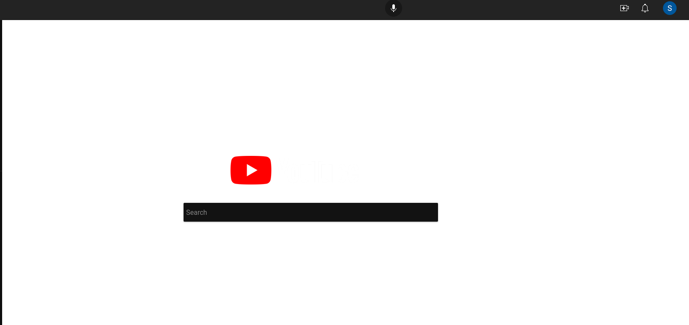

I've been trying to patch together what the right way of consuming media is the current age. Or rather, right now in 2023, since this stuff changes so fast it's hard to think through what things will look like in 5 years. Each year the amount of information thrown at me has grown more and more....... incomprehensible. Now, I'm way more of a digital recluse than most people -  I have fortunately escaped the need to use many social media sites like Facebook or Instagram or Snapchat (till now). I'm interested in setting a blueprint for myself for the next few years so that I stay sane. Here are my current sources right now:

* *YouTube*: fun + educational. My feed is usually filled with fitness videos, some stand-up comedy, some tech videos and podcast clips. I unfortunately started watching YouTube shorts more and more past few months, which I am trying to escape. There's always the occasional rabbit hole I dive into, when my feed changes drastically for a week or so. This is more or less random - happening maybe in a once in a few months - a mix of past passions re-emerging (A few months back I watched 18 hours of God of War Ragnarok gameplay because, yeah...) and passing trends (I watched wayy too many clips about WallStreetBets "degenerates" blowing all their money on GameStop in 2021).  I do occasionally get really into tech videos, and occasionally some podcast-clips.
* *Twitter*: Tech-related content. I use Twitter every day to learn a little bit about what's happening in the world of startups, machine learning, etc. It took me some time to figure out how to end mindless scrolling on the site though (more on this below). 
* *Google News*: News. This has usually turned out to be more of a distraction than useful till now, and I've mostly stopped using this.
* *Newsletters:* I like to use Morning Brew for a quick short summary of what's happening (in the U.S). I'm also subscribed to Benedict Evans' newsletter and Stratechery, by Ben Thompson - these I read much less than I want to ( maybe once in 2 weeks). 
* *Podcasts:*  I listen to podcasts as well, maybe once a week or so. I don't know much about the space, but I do listen to Joe Rogan, Andrew Huberman and used to listen the All-in Podcast . There may be a number of things you can disagree with Joe Rogan on, but there are few very people who get to have 3 hour conversations with people like Mark Zuckerberg, Naval Ravikant and Marc Andreesen! 

Okay, with that aside, I am trying to do the following to stay sane and be productive: 

## **Only the Best**

Whether it's a podcast, TV series or a movie, I simply don't want to be bothered to listen to/watch the latest hot garbage. I think there's so much good content out there right now that it's better to rewatch the best rather than finish the new., I think you're better off rewatching Dunkirk or Dark Knight Rises than watching Phase 10 Marvel movies. I was recently listening to Joe Rogan and Marc Andreesen and the information density was..... unbelievable. It's better to listen to Joe Rogan talk with Marc Andreesen again rather than the latest episode of him talking to a random celebrity. Re-read the best books out there - Poor Charlie's Almanack will probably reveal something more interesting than the latest "The Alchemist"-type novel.

## **Curate your Home (feed)** 

James Clear, in his book Atomic Habits says that environment is the invisible hand that shapes human behaviour. If I go to the kitchen and notice candy bars lying on the counter, I might eat one or two, even if I was never thinking about having one or I wasn't even hungry. If I open up Twitter and notice some interesting thread breaking down a crypto scam or find a funny tweet from Conan O'Brien, it's hard to not interact with it. I might have gone to YouTube to check out a Node.js tutorial, but I might end up clicking on one of the 10 funny cat videos on my homepage. To paraphrase James Clear, the more available the distraction is, the harder it is to avoid it. Currently, social media home feeds are just not meant for you to quickly find the information you were looking for or focus on this one topic you like. Here are some things I've done:

* *Twitter*: I stopped following people and started using Twitter Lists to bucket different accounts into a topic of interest. Made things much simpler, and I didn't have use for the Home feed anymore. In 2022 Twitter seems to have added a lot more recommended content on the home feed though, and it seems...pretty good, actually. 
* *YouTube:* On my laptop, I've installed an extension to block out all the noise on the home page, and just give me the search bar

I still use my phone to watch whatever I want on YouTube, but my laptop feels more like a work thing now. I've been struggling a bit to escape YT shorts (averaging atleast an hour per day in Summer 2023) for now - it's almost impossible to curate this, so let's see where this goes!

Update 10/01/23: I'm now mostly using just Twitter and Morning Brew to catch up on things. Got rid of the YouTube app, fuck that. Still do like to use it on Chrome to pass some time now and then, but things are under control. I'm using Twitter A LOT though. It's mostly just about the crazy world of LLMs these days, which I can't help dipping into. 
