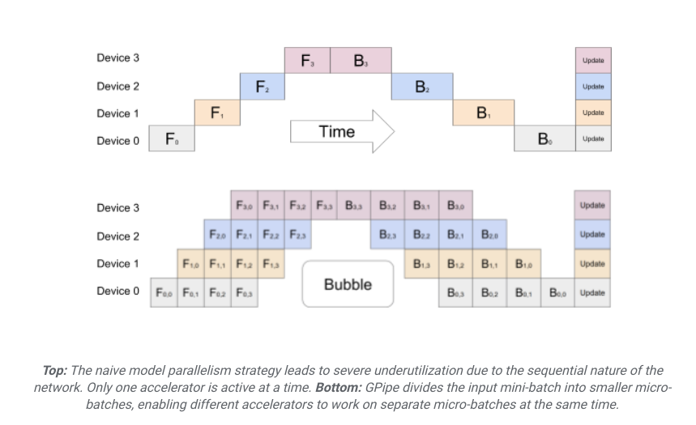
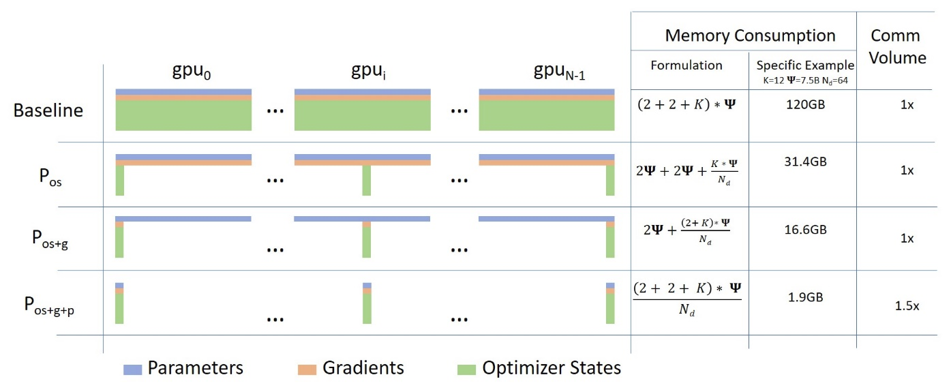
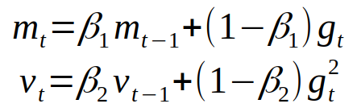
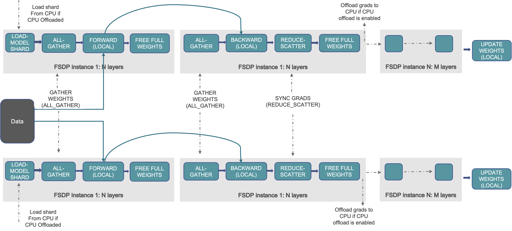
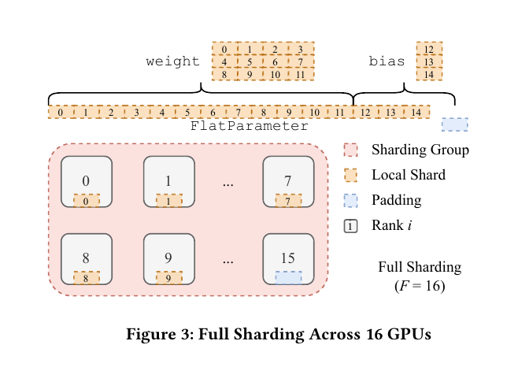
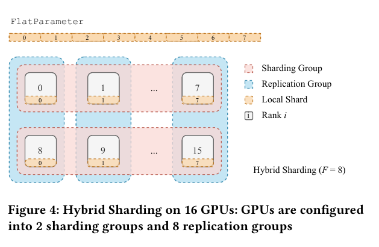
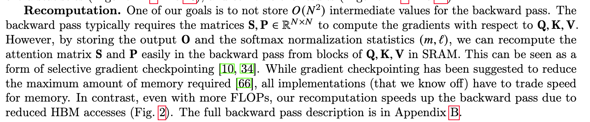

There's been an insane amount of interest in large language models (LLMs) these days, with a very special open source community of hackers figuring out the best way to finetune, serve and run inference on consumer-grade hardware. A number of excellent open-source codebases have popped up to meet these needs, notably [FastChat](https://github.com/lm-sys/FastChat/), [Axolotl](https://github.com/OpenAccess-AI-Collective/axolotl) and [LLama.cpp](https://github.com/ggerganov/llama.cpp), with the 🤗HuggingFace ecosystem being at the center of it all. I wanted to write this post to focus on the nitty gritty details of distributed training strategies, specifically DeepSpeed and FSDP, along with a summary of different efficient finetuning methods, with special focus on multi-GPU and multi-node training. The trend right now is clear: We're going to be using more and more compute, and thus more GPUs with bigger models. So, understanding these topics is important in this context, especially so when you're trying to up your game from just using a home server with a couple of 3090s, to, say, a GCP container with 8xA100 80GBs. This is also relevant for startups/ companies who are trying to get into fine-tuning their own language models. For actual large scale training taken up by the big tech companies, there's plenty of material, mostly from [Stas Bekman](https://github.com/stas00/ml-engineering), who led the training for BLOOM-176B, and there's very little use for [GPU-poors](https://www.semianalysis.com/p/google-gemini-eats-the-world-gemini) in focusing on that. This is also more of a *synthesis* of ideas from different excellent resources out there already, with the main focus on what you can do in the 🤗HuggingFace ecosystem, along with practical considerations, mostly from a number of sources online (it's not pretty) and some learnt from my internship in Summer 2023. In short, I hope to answer the following questions:
1. What do we care about with distributed training and performance?  What happens under the hood with DeepSpeed and FSDP? 
3. What hardware setup do I need for different distributed training strategies? What are the caveats?
4. What are the various efficient finetuning optimizations? What are the tradeoffs?
5. What are some practical guidelines that can capture all the salient finetuning optimizations, in order to train large models in a multi-GPU and multi-node setting?
6. What open-source codebases can I use right now? What are the pros and cons?

# Table of Contents
1. [Distributed Training Basics](#distributed-training)
2. [ZeRO-powered Data-Parallelism](#zero-powered-data-parallelism)
    1. [Baseline](#baseline)
    2. [ZeRO Stage 1](#zero1)
    3. [ZeRO Stage 2](#zero2)
    4. [ZeRO Stage 3](#zero3)
    5. [ZeRO-R](#zero-r)
    6. [ZeRO-Offload](#zero-offload)
    7. [ZeRO-Infinity](#zero-infinity)
    8. [ZeRO++](#zero)
3. [Fully-Sharded Data Parallel](#fully-sharded-data-parallel)
    1. [Full Sharding](#full-sharding)
    2. [Hybrid Sharding](#hybrid-sharding)
4. [Implementations](#implementations)
    1. [How can you use DeepSpeed and FSDP?](#how-can-you-use-deepspeed-and-fsdp)
    2. [What about Pipeline and Tensor Parallelism?](#what-about-pipeline-parallelism-and-tensor-parallelism)
    3. [Are DeepSpeed and FSDP Here to Stay?](#are-deepspeed-zero-and-fsdp-here-to-stay)
5. [Efficient Finetuning](#efficient-finetuning)
    1. [Mixed Precision Training](#mixed-precision)
    2. [Parameter-Efficient Fine Tuning](#parameter-efficient-fine-tuning-peft)
    3. [Flash Attention](#flash-attention)
    4. [Gradient/Activation Checkpointing](#gradient-activation-checkpointing)
    5. [Quantization](#quantization)
    6. [Gradient Accumulation](#gradient-accumulation)
    7. [So wait, should I always try to increase batch size?](#so-wait-should-i-always-try-to-increase-batch-size)
6. [Practical Guidelines](#practical-guidelines)
    1. [The Ultimate Summary](#the-ultimate-summary)
    2. [Additional Guidelines](#additional-guidelines)
7. [More on DeepSpeed and FSDP](#more-on-deepspeed-and-fsdp)
    1. [Multi-node with DeepSpeed ZeRO-3](#multi-node-with-deepspeed-zero-3)
    2. [DeepSpeed Memory Requirements](#deepspeed-memory-requirements)
    3. [Usage with 🤗Accelerate](#usage-with-🤗accelerate)
8. [Open-Source Codebases](#open-source-codebases)
    1. [FastChat](#fastchat)
    2. [Axolotl](#axolotl)
    3. [Useful Fine-tuning Guides](#useful-fine-tuning-guides)
9. [The End](#the-end)

# Distributed Training 
This is a very broad topic with much talked about, so I won't cover everything. When it comes to training/finetuning LLMs, typically you're dealing with large model sizes (10B+) and large dataset sizes (1T+ tokens while pretraining, 1M+ in supervised fine-tuning). Our ultimate goal in getting done with training as fast as possible is to maximize  *throughput*, i.e we want to be able to process as many samples per second as we can. LLMs require a LOT of GPU vRAM to train, not just because of the large model weights (Falcon 40B, with 40B parameters, needs around 74GB just for model weights in BF16), but also because of optimizer states - with vanilla AdamW, you need [12 bytes per parameter](https://blog.eleuther.ai/transformer-math/) to store a copy of the model weights, the momentum and the variance parameters. This is where we need smart distributed training strategies, where each GPU worker only deals with a fraction of training state and data. 

The main parallelism strategies are:
1. Data Parallelism(DP): Each GPU worker gets a fraction of the total mini-batch of data, and computes the gradients on that fraction of the data. The gradients are then averaged across all workers, and the model weights are updated. In it's most basic form, like the one in PyTorch DDP, each GPU stores a copy of the model weights, optimizer state and gradients for the fraction of the data it's working on. 
2. Model Parallelism/ Vertical Model Parallelism (MP): In model parallelism, models are *vertically sliced*, with different layers of the model placed on different GPU workers. Consider the case where a single model with 12 layers is placed on 3 GPUs. 

<div style="text-align:center;">

<pre>
---------------  ---------------  -----------------
1 | 2 | 3 | 4 |  5 | 6 | 7 | 8 |  9 | 10 | 11 | 12 |
---------------  ---------------  -----------------
</pre>

</div>
In naive model parallelism, all the GPUs, while processing the same batch of data, wait for the previous GPU to finish computation, and then processs the data. Of course, this means that all but one GPU is actually doing any work at a given moment (hence "naive").

An improvement is Pipeline Parallelism (PP), which gives you the illusion of parallelism by overlapping computation for different micro-batches of data. This is just like the classic pipeline in computer architecture. From the [GPipe](https://blog.research.google/2019/03/introducing-gpipe-open-source-library.html) blog:
 > To enable efficient training across multiple accelerators, GPipe partitions a model across different accelerators and automatically splits a mini-batch of training examples into smaller micro-batches. By pipelining the execution across micro-batches, accelerators can operate in parallel. 



3. Tensor Parallelism (TP): In tensor parallelism, each GPU processes only a slice of a tensor by *vertically slicing* the model across GPU workers. Each worker processes the *same batch* of  data, computing the activations for the part of the weights they have, exchanging parts that each other needs, with each worker computing the gradients for the slice of the weights it has. 

You can have a combination of the various parallelism strategies above for even better throughput gains. That said, let's take a closer look at two improvements for data-parallel training: Zero Redundancy Optimizer and the closely related Fully Sharded Data-Parallel strategies.

A comment: I'll be loosely using the term "GPU worker" to refer to individual processes that run on each GPU. It's not very precise, but for a DP setting I find it convenient and more approachable.

<u> Further reading </u>:
- Efficient Training on multiple GPUs: https://huggingface.co/docs/transformers/perf_train_gpu_many 
- How to Train Really Large Models on Many GPUs?: https://lilianweng.github.io/posts/2021-09-25-train-large/ 

# ZeRO-powered Data-Parallelism
This is one of the most efficient and popular strategies for distributed training at the moment. DeepSpeed's [ZeRO](https://arxiv.org/abs/1910.02054), or Zero Redundancy Optimizer, is a form of *data parallelism* that massively improves on memory efficiency. The main idea is that the ZeRO exploits memory redundancy in data-parellel training and the latest improvements in fast inter-GPU communication to improve throughput, with some increase in communication volume, depending on the stage. ZeRO actually has two components - ZeRO-DP (data pallelelism) and ZeRO-R (residual memory). The DeepSpeed team has also put forth a number of followup optimizations that make ZeRO even more compelling - ZeRO-Offload/Infinity (offloading computation to CPU/ NVMe disk) and ZeRO++ (with flexible multi-node training and quantized weights).  

ZeRO-DP can be best visualized in this diagram (from [DeepSpeed's blog post](https://www.microsoft.com/en-us/research/blog/zero-deepspeed-new-system-optimizations-enable-training-models-with-over-100-billion-parameters/)):


The different methods, while training a 7.5B parameter model on 64 GPUs, have the following performance:
1. **Baseline**: PyTorch DDP
2. **ZeRO Stage 1/ $P_{os}$** : 4x memory reduction (example specific) with the same communication volume as the Baseline (no additional inter-GPU communication)
3. **ZeRO Stage 2/  $P_{os+g}$** : 8x memory reduction (example specific) with the same communication volume as the Baseline.
4. **ZeRO Stage 3/ $P_{os+g}$**: 64x memory reduction (example specific), with 1.5x communication volume as the Baseline (this 1.5x is across different hardware setups and model sizes).


## Baseline
Simple data parallelism as implemented in PyTorch DDP. Each GPU worker has a copy of the model weights, optimizer state and gradients. After a backward pass, the gradients are averaged across all workers (the all-reduce step), and the model weights are updated.

_Comment on communication volume_: For understanding the benefits of ZeRO, I think it's important to understand what communication volume means exactly. In typical DP, you have an [all-reduce](https://docs.nvidia.com/deeplearning/nccl/user-guide/docs/usage/collectives.html#allreduce) step where all the workers send out the gradient array that they have, and then receive gradient arrays from the other workers to get the average value. From the ZeRO paper:

>State-of-art implementation of all-reduce uses a two-step approach, where the first step is
>a reduce-scatter operation, which reduces different part of the data on different process. The
>next step is an all-gather operation where each process gathers the reduced data on all the
>process. The result of these two steps is an all-reduce. Both reduce-scatter and all-gather are
>implemented using a pipelined approach, that results in a total data movement of Ψ elements
>(for a data with Ψ elements) for each. Therefore, the standard DP incurs 2Ψ data movement
>during each training step.
 
In this case, "data" is our gradients, and process refers to individual worker processes running on each GPU. All in all, what I want to convey here is that, if you have $\Psi$ parameters, you incur a communication cost of $2\Psi$ with plain DP.

## <a name="zero1"></a> ZeRO Stage 1 /$P_{os}$ (Optimizer State Partioning)
Here, only the optimizer state is partitioned/ sharded across GPU workers, with model weights and gradients replicated across all workers. After a backward pass, you have a regular all-reduce step to get the average gradient value across all workers. Now, each worker updates the optimizer state in it's partition. Recall the Adam equations:



<center></center>

($w$, $g$, $v$ and $m$ correspond to weight, gradient, velocity and momentum respectively). Notice that these are all element-wise operations, with no dependency across different slices of weights (after computing gradients, that is). 

_Communication volume_: Okay, so you might say, you first have an "all-reduce" operation that communicates the updated gradients to all the GPUs and then, after updating optimizer state for their partition, each GPU must still get the updated weights from the other GPUs. Doesn't this increase communication volume? This detail isn't clear even in the ZeRO paper! From my understanding, this implementation is in fact the same for both ZeRO Stage 1 and Stage 2: 
- All-reduce for gradients consists of two components - [reduce-scatter](https://docs.nvidia.com/deeplearning/nccl/user-guide/docs/usage/operations.html#reducescatter) and [all-gather](https://docs.nvidia.com/deeplearning/nccl/user-guide/docs/usage/operations.html#allgather).
-  With both DeepSpeed ZeRO 1 and 2, you have the usual reduce-scatter, where different parts of the gradient are reduced on different GPUs. After this, each GPU will compute the updated weights corresponding to the optimizer partition it has, and then, you only need one all-gather operation, this time to communicate the updated model parameters to all other GPUs. Thus you have a reduction in memory consumption at the same communication volume (which is to say, for free)!


## <a name="zero2"></a>  ZeRO Stage 2 / $P_{os+g}$ (Optimizer State + Gradient Partitioning)
Here, both the optimizer state and the gradients are partitioned/sharded across workers. This means that, not only are two GPU workers looking at a different micro-batch of data during training, they are also maintaining gradients for a subset of model parameters. The key insight here is that each worker is updating its partition of optimizer state, and thus the gradients (or rather, the reduced/averaged gradients) needed for a worker is simply the one corresponding to that state partition. Coming to the implementation, as mentioned above, DeepSpeed effectively performs a reduce-scatter operation, where gradients corresponding to different workers are averaged at that worker (instead of the typical all-reduce for all parameters). This means that you now have even more memory savings, again at the same communication volume - that is, there are no extra costs with respect to data movement compared to DDP!

**Note**: With Both ZeRO Stage 1 and 2, you still need the entire model to fit on 1 GPU. There are also caveats with RAM usage - model initialization takes up a huge amount of RAM as you increase number of processes/ GPUs and go to large model sizes (40B+). ZeRO 3 improves on this.

## <a name="zero3"></a>  ZeRO Stage 3 / $P_{os+g+p}$ (Optimizer State + Gradient + Parameter Partitioning)
This to me is the most interesting ZeRO stage. Stage 3 partitions the model parameters across workers, in addition to optimizer state and gradients. A helpful visualization from DeepSpeed:

<center></center>

<center></center>

To borrow an example from [Stas Bekman's guide](https://github.com/stas00/ml-engineering/tree/master/model-parallelism), suppose you have the following 3-layer model and 4 GPUs:

```
La | Lb | Lc
---|----|---
a0 | b0 | c0
a1 | b1 | c1
a2 | b2 | c2
a3 | b3 | c3
```
With DeepSpeed ZeRO3, your GPUs will be populated as follows:

```
GPU 0:
La | Lb | Lc
---|----|---
a0 | b0 | c0

GPU 1:
La | Lb | Lc
---|----|---
a1 | b1 | c1

GPU 2:
La | Lb | Lc
---|----|---
a2 | b2 | c2

GPU 3:
La | Lb | Lc
---|----|---
a3 | b3 | c3
```

Each layer of the model is *horizontally sliced*, with each worker storing a part of the weight tensors. During the forward and backward pass (recall that each GPU worker is still seeing a different micro-batch of data), different GPU workers exchange the parts of the each layer that they have (*parameter communication on-demand*), and compute activations/ gradients. The rest is similar to ZeRO Stage 2. The communication volume for ZeRO-3 can be easily seen to be 1.5x times baseline DDP: for every training step, you have an extra all-gather operation for model parameters in the forward pass. The amount of data being moved in this operation is again $\Psi$ (per GPU), and thus total communication volume is $\Psi$ (parameter all-gather) + $\Psi$ (gradients reduce-scatter) + $\Psi$ (gradients all-gather) = $3\Psi$ = 1.5x DDP.  This is pretty impressive considering that the memory consumption has been cut down by the number of GPU workers $N$. Another key observation from the ZeRO paper:

  > ZeRO powers DP to fit models with arbitrary size as long as there are sufficient number of devices to share the model states.
  
That is, you are now no longer limited by the per-GPU vRAM for data parallel (DP) training, as long as you have enough GPUs (easier said than done, I know).

## ZeRO-R
 I won't go much into this, but ZeRO-R improves on ZeRO-DP by focusing on memory consumption by activations, and managing memory fragmentation. ZeRo-R reduces activation memory footprint by partitioning the activations as well. It also makes some more improvements in managing temporary buffers, which you can think of as memory allocated for storing intermediate 
results during gradient accumulation and reduction across workers. 

## ZeRO-Offload
ZeRO-Offload is an optimization technique that can offload optimizer and computation from GPUs to the host CPU. At the time it was released in January 2021, ZeRO-Offload could achieve 40 TFLOPS on 1 NVIDIA V100 GPU (V100 32 GB vRAM, with a maximum throughput of 130 TFLOPS) for a 10B parameter model. With Pytorch DDP, the maximum is 30 TFLOPS, which you get can with a 1.4B parameter model, which is the largest you can run without running out of memory. The main problem with offloading computation to the CPU is that this is multiple orders of magnitude slower than GPU (based on throughput). The smart strategy adopted in ZeRO-Offload is that only the less intensive computations ( $< O(MB)$, where $M$ is the model size and $B$ is the batch size) are offloaded to CPU so that the total compute complexity stays the same ($O(MB)$). In practice, this means that operations like norm calculations, weight updates, etc can be done on CPU, while forward and backward pass matrix mults need to be done on GPU. ZeRO-Offload works with all stages of ZeRO (1, 2 and 3).

[Here's](https://docs.it4i.cz/dgx2/introduction/) the specification for the DGX-2 node used in their experiments, which has 16 V100 GPUs. Note that if you're in the ZeRO-2 setting, ZeRO-Offload will still be limited by the available per-GPU memory i.e fitting the entire model on each GPU can be the bottleneck. 

## ZeRO-Infinity
ZeRO-Infinity is an improvement over ZeRO-Offload which came up in April 2021, by allowing offloading to disk (NVMe memory), and making some improvements to CPU offloading. ZeRO-Infinity was shown to fit models with 10-100T+ parameters (Trillion!) for training on just one DGX-2 node. ZeRO-Infinity does this by exploiting CPU and NVMe memory simultaneously. Here's a visualization from the paper:

<center></center>

Unlike ZeRO-Offload, ZeRO-Infinity is specifically built on top of ZeRO-3. In their evaluations of model speed on 512 GPUs across 32 DGX-2 nodes, the authors showed that ZeRO-Infinity trains up to 20 trillion parameter models with throughput of up to 49 TFlops/GPU, while using alternative parallelism strategies like 3D parallelism only allows you to train 40x smaller models. There are some bandwidth requirements for ZeRO-Infinity to be a competitive choice, namely for NVMe-CPU and CPU-GPU communication.  


In terms of the differences between ZeRO-Offload and ZeRO-Infinity, here is a comment from the DeepSpeed team:

> DeepSpeed first included offloading capabilities with ZeRO-Offload, a system for offloading optimizer and gradient states to CPU memory within ZeRO-2. ZeRO-Infinity is the next generation of offloading capabilities accessible to ZeRO-3. ZeRO-Infinity is able to offload more data than ZeRO-Offload and has more effective bandwidth utilization and overlapping of computation and communication.

By default, ZeRO-Infinity's optimizations play in when you offload with ZeRO-3, while ZeRO-Offload is used when offloading with Stage 1/2.


<u>Further Reading</u>:
1. ZeRO-Offload/Infinity Tutorial: https://www.deepspeed.ai/tutorials/zero-offload/
2. ZeRO-Offload - Democratizing Billion-Scale Model Training :  https://arxiv.org/abs/2101.06840 
3. ZeRO-Infinity - Breaking the GPU Memory Wall for Extreme Scale Deep Learning: https://arxiv.org/abs/2104.07857 

## ZeRO++
ZeRO++ is a recent improvement to ZeRO-3 from the DeepSpeed team. Key improvements:
1. Quantized weights (qwZ) : Reduces all-gather  parameter communication volume by half by quantizing model weights to int8.
2. Hierarchical Partitioning (hpZ): Hierarchical partitioning is a hybrid partitioning scheme that can help in multi-node settings with DeepSpeed ZeRO 3. In this case, you can have model parameter sharding happening within a node, and then have replication across nodes. This means that you don't have the same amount of memory savings as classic ZeRO-3 running for the full setup, but you avoid expensive inter-node parameter communication overhead, thereby improving throughput in general. I much prefer the term "hybrid sharding" used in FSDP to "hierarchical partitioning" though, and  we will revisit this when we look at FSDP below.
3. Quantized gradients (qgZ): Enables even more savings in communication volume by replacing fp16 with int4 quantized data during gradient reduce-scatter ops (Recall: this is the gradient gather + averaging step in ZeRO 2/3 with sharded gradients).

Overall, ZeRO++ reduces communication volume by 4x with these three improvements, compared to ZeRO-3. 

<u>Further reading</u>:
- ZeRO: Memory Optimizations Toward Training Trillion Parameter Models: https://arxiv.org/abs/1910.02054 
- ZeRO tutorial: https://www.deepspeed.ai/tutorials/zero/ 
- ZeRO++: Extremely Efficient Collective Communication for Giant Model Training: https://arxiv.org/abs/2306.10209
- ZeRO++ tutorial: https://www.deepspeed.ai/tutorials/zeropp/ 

# Fully-Sharded Data Parallel
Fully-Sharded Data Parallel (FSDP) is another data-parallelism technique aimed at improving memory efficiency with limited communication overhead, and thus throughput. FSDP's sharding strategy is based on ideas from [Xu *et al*](https://arxiv.org/abs/2004.13336) and ZeRO. FSDP has two sharding strategies: Full Sharding and Hybrid Sharding. 

## Full Sharding
This is mostly the same as ZeRO-3 where you have parameters, optimizer state and gradients being sharded across workers/ devices. From the FSDP blog, this is a pretty low-level visualization of different operations involved with 2 devices:


As you can see, each worker/device holds only a subset of the weights, and you have *parameter communication on-demand* to compute intermediate activations and gradients. From [PyTorch's FSDP tutorial](https://pytorch.org/tutorials/intermediate/FSDP_tutorial.html):

> In forward path

> - Run all_gather to collect all shards from all ranks to recover the full parameter in this FSDP unit
> - Run forward computation
> - Discard parameter shards it has just collected

> In backward path

> - Run all_gather to collect all shards from all ranks to recover the full parameter in this FSDP unit
> - Run backward computation
> - Run reduce_scatter to sync gradients
> - Discard parameters

Here, "rank" is a GPU worker. 

Another helpful visualization, especially in contrasting full vs hybrid sharding is from the paper:


## Hybrid Sharding



Hybrid sharding consists of both *sharding* and *replication*. What this means is that, given a number of workers/GPUs $W$, the sharding happens only across subsets of size $F$, with replication across different subsets. Let's make this more specific. Suppose you wish to do multi-node training across 2 nodes with each being a `a2-ultragpu-8g` node in GCP. You have 8xA100 GPUs in each node, with a total of 16 workers. You can use hybrid sharding to shard model parameters inside each node, and then have replication across nodes. What this means is that in each forward/backward pass, you have similar all-gather and reduce-scatter operations within each node, namely to get model parameters from other GPUs (intra-node) and compute intermediate activations and gradients. Now, you further have another all-gather across nodes to get an averaged gradient value for the total mini-batch of data being processed in that training step. This is especially attractive when you're forced to deal with sharding parameters (i.e ZeRO 2/1 is not an option) and you're in a multi-node setup. This is similar to the "hierarchical partitioning" feature in ZeRO++. 

# Implementations
## How can you use DeepSpeed and FSDP?
One of the main advantages of DeepSpeed ZeRO/ FSDP is that you get the kind of memory savings and throughput in  data + tensor parallelism while actually being only in a data-parallel setting. This means that you do not need any ad-hoc architecture changes, or change your forward pass with messy `.to()` device castings, or any customizations. So ZeRO / FSDP really works across different architectures (which is why, lo and behold, we get good integrations). ZeRO is implemented in Microsoft's DeepSpeed library and is integrated into the 🤗 Accelerate library.  FSDP is a part of PyTorch itself, and again has an integration in the 🤗 Accelerate library. You can thus use either of these strategies, from the [Trainer](https://huggingface.co/docs/transformers/main_classes/trainer) API (which uses Accelerate in the backend), or directly with Accelerate. 

## What about Pipeline Parallelism and Tensor Parallelism? 

Pipeline Parallelism (PP) and Tensor (TP) currently require architecture changes and/or changes in the forward pass of the model. If you wish to use PP with DeepSpeed, [you'd need to make changes to the model architecture definition](https://www.deepspeed.ai/tutorials/pipeline/#alexnet). This, coupled with the fact that the 🤗Transformers library implements a dozen odd features for each model makes the situation very messy for an integration. Of course, you already have naive model parallelism with `device_map="auto"`. This is a VERY BAD strategy overall to use multiple GPUs, and only relevant if you can't fit the model on one GPU (might as well use one GPU otherwise). If you really do want PP and TP, the best option for now seems to be to use [Megatron-LM](https://github.com/NVIDIA/Megatron-LM) and stick to the models they support (BERT, GPT-2, T5, Llama). You can also make use of ZeRO-powered DP + DeepSpeed PP + Megatron TP in [Megatron-DeepSpeed](https://github.com/bigscience-workshop/Megatron-DeepSpeed), but only for training models based on BERT, GPT-2 and T5. At some point, [there was an effort](https://github.com/huggingface/transformers/issues/8771), led by Stas Bekman, in trying to figure out how to get PP and TP implemented in 🤗HuggingFace, but that didn't pan out. From [Bekman's engineering blog](https://github.com/stas00/ml-engineering/tree/master/model-parallelism):

> 🤗 Transformers status: as of this writing none of the models supports full-PP. GPT2 and T5 models have naive MP support. The main obstacle is being unable to convert the models to      nn.Sequential and have all the inputs to be Tensors. This is because currently the models include many features that make the conversion very complicated, and will need to be removed to accomplish that.

Hey, open source can't say we didn't try, since we did throw Stas Bekman at this problem, so maybe we this is too big a beast to tackle.

## Are DeepSpeed ZeRO and FSDP here to stay?
DeepSpeed ZeRO and PyTorch FSDP are _mostly_ going to stay, or rather, will likely be replaced _only_ by a strategy that is very similar. The main reason I believe so is easy of use. The only constant in our world of LLMs is change. With new models, architectures, attention implementations, positional embedding improvements, etc coming every day, the ability to swap out one architecture for another, and in a matter of hours, be able to launch a training run of a 40B+ parameter model on 10M samples is important. Even if a new DP + PP + TP strategy ends up squeezing out higher throughput than ZeRO-powered DP, we're likely not going to see much adoption. I think we're also likely to see more focus and thus throughput optimizations, and perhaps even custom compute cluster configurations coming up geared towards the pure data-parallel category for the same reason. So we won't be doing too bad sticking to only DP. 

(Of course, this is not relevant for the Very Large Language Model training taken up by OpenAI, Anthropic, etc)

# Efficient Finetuning
Another hot topic! I will simply list out some of the most popular optimizations:
## Mixed Precision
This is now a no-brainer with large model training. In short, weights, activations and gradients are stored in half-precision formats while you have a "master copy" of the weights in FP32/ single-precision. The two half-precision formats commonly used are BF16 ("[Brain Float 16](https://en.wikipedia.org/wiki/Bfloat16_floating-point_format)", developed by Google Brain) and FP16. FP16 needs additional loss-scaling in order to prevent gradient underflow, while BF16 doesn't seem to have these issues. 

<u>Further reading</u>:
1. Mixed Precision Training: https://arxiv.org/abs/1710.03740 
2. Performance and Scalability: How To Fit a Bigger Model and Train It Faster: https://huggingface.co/docs/transformers/v4.18.0/en/performance 

## Parameter-Efficient Fine-Tuning (PEFT)
PEFT methods aim to reduce the memory requirements during finetuning, by freezing most of the model weights and having a subset/ a small number of additional parameters as trainable. The most popular PEFT method is [LoRA](https://huggingface.co/docs/peft/conceptual_guides/lora), where you finetune a low-rank version of weight updates to your model parameters. Another effective PEFT method is [IA$^3$](https://huggingface.co/docs/peft/conceptual_guides/ia3), which injects trainable vectors into key, value and feedfoward layers in a  transformer-based architecture.  With both LoRA and IA$^3$, the added weights/vectors can be _merged_ with the base weights, meaning that, at inference time, there are no additional computations (addition/multiplication). The downside is that performance _can_ be lesser than when you perform full finetuning. This however, has rapidly changed, and LoRA-based approaches can infact _match_ full fine-tuning performance, if you add trainable weights to ALL linear layers (See [QLoRA](https://arxiv.org/abs/2305.14314)).  With respect to IA $^3$, in my experiments with small models like GPT-2 (770M), I've found that IA $^3$ can match LoRA's performance with less than 1/10th the number of trainable parameters. This still needs more community experimentation though, especially at the scale of LLama-2-7B or Falcon-40B. 

<u>Further reading</u>:
- Low-Rank Adapatation of Large Language Models: https://arxiv.org/abs/2106.09685 
- A Conceptual Guide to LoRA in 🤗 PEFT: https://huggingface.co/docs/peft/conceptual_guides/lora
- A Conceptual Guide to IA$^3$ in 🤗 PEFT: https://huggingface.co/docs/peft/conceptual_guides/ia3 
- Efficient Fine-tuning of T5-XXL with LoRA: https://www.philschmid.de/fine-tune-flan-t5-peft 

## Flash Attention
Flash attention is a _fast_ (you get speedup!), _memory-efficient_ (while saving memory!), _exact_ (with no approximations!) _IO-aware_ (by accounting for reads/writes across different levels of GPU memory!) attention algorithm.  With FlashAttention 2 (it's only been here since July 2023), you can get 220+ TFLOPS on an A100 80GB (which has a maximum of 315 TFLOPS). To put that into perspective, when Flash Attention 1 came along in mid-2022, it had the best throughput you could get, which was up to 124 TFLOPS. Further, with some of the DeepSpeed ZeRO papers we looked at before, the achievable peak throughput was estimated to be around 70 TFLOPS in 2021 on a Tesla V100!

Currently, Flash Attention supports Ampere, Ada, or Hopper NVIDIA GPUs (A100, RTX 3090, H100,etc), and only half precision datatypes bf16/fp16. To use flash attention with 🤗Transformers, you only need [one flag change](https://x.com/younesbelkada/status/1705258148045750343) for LLama and Falcon (pass `use_flash_attention=True` to `AutoModel`). For the rest of the 🤗 models, this requires manually changing the attention function used in the `forward` methods to flash-attention's high throughput version, [but this is fast developing](https://github.com/huggingface/transformers/issues/26350). Flash Attention should be integrated into PyTorch's `scaled_dot_product_attention` soon, so that you don't have to rely on monkey patches. (This was supposed to happen with v2.1, but will hopefully happen in the near future)

Flash Attention v1.0 has also been available in 🤗[Optimum](https://huggingface.co/docs/transformers/en/perf_infer_gpu_one#decoder-models) for some time, but you can't have padding tokens, which makes it very restrictive.

<u>Further reading</u>:
- ELI5: Flash Attention: https://gordicaleksa.medium.com/eli5-flash-attention-5c44017022ad 
- FlashAttention-2: Faster Attention with Better Parallelism and Work Partitioning -  https://tridao.me/publications/flash2/flash2.pdf 

## Gradient/ Activation Checkpointing
Typically, in each forward pass, all the intermediate activations are retained in memory, as they are needed to compute the backward pass. Gradient/Activation checkpointing is a technique to reduce memory consumption by  only retaining a subset of intermediate activations, and recomputing the rest as needed. The tradeoff involved is in the additional recomputation time. A good rule of thumb from HuggingFace is that gradient checkpointing slows down training by 20%. The memory requirement for activations, when you have N model layers, drops off from $O(N)$ to $O(\sqrt{N})$. Of course, with total memory consumption, the drop-off would not be this great, because you have a lot more than activations being stored.

<u>Further reading</u>:
- Fitting large networks into memory: https://medium.com/tensorflow/fitting-larger-networks-into-memory-583e3c758ff9 
- Performance and Scalability: How To Fit a Bigger Model and Train It Faster: https://huggingface.co/docs/transformers/v4.18.0/en/performance 

## Quantization
This one's a ✨ hacker favourite ✨! I'm going to be brief here. With quantization approaches, there are two kinds:
- <u>Post-Training Quantization (PTQ)</u> - These are approaches aimed at efficient _inference_. [LLM.int8()](https://arxiv.org/abs/2208.07339), [GPTQ](https://arxiv.org/abs/2210.17323) come here. 
- <u>Quantization-aware training</u>: In the original sense of the term, this meant to train a model from the start using quantized weights and activations, for use later during inference. This is what we want here - a strategy to train with quantized parameters. [QLoRA](https://arxiv.org/abs/2305.14314) comes in this category (kind of, since it does integrate quantization into the training process). The main idea with QLoRA is that it quantizes the base, pretrained model weights to 8/4 bits and then trains additional LoRA parameters in floating-point half/full precision. This is a very powerful strategy, enabling finetuning of 60B+ parameter models on a single GPU with 48GB vRAM. The caveat, of course, is that you are stuck with much worse throughput. The reason is simple - you have an additional de-quantization step happening whenever you compute activations for a given layer. (The exact number is dependent on the hardware setup. For example, you might be able to run Falcon-40B training with DeepSpeed ZeRO 3 on 8xA100s without quantization, and training with quantization would be useless here, even if you can get a better batch size. This is not the same with just 2xA100s). 

**Side Note**: The full QLoRA paper is worth reading. Beyond the fact that their approach enabled training a 65B model on 1 consumer GPU (this was the largest open source language model at the time), the paper also showed that LoRA-based training can _match_ full fine-tuning (they added more trainable layers, but quantizing the base weights made it _more efficient_ than the original LoRA configuration), and that dataset quality was paramount in supervised finetuning (450K FLAN samples is worse than 9K high-quality human-labelled samples). 

<u>Further reading</u>:
- QLoRA: https://arxiv.org/abs/2305.14314 
- Quantize 🤗Transformer models: https://huggingface.co/docs/transformers/v4.34.0/en/main_classes/quantization 

## Gradient Accumulation
Gradient accumulation is a way to increase your effective batch size at some drop in throughput (and sometimes, for free!). This is best explained with an example. Let's say you have batch size of 2, and a gradient accumulation step size of 4. With gradient accumulation, you would have your regular forward and backward passes in every training step, but, you would have an optimizer step (`optimizer.step()` in PyTorch) being called once every 4 training steps. What this means is that gradients get accumulated over 4 steps and then the model weights get updated using the average gradients across 4*2 = 8 samples. You've now got an increase in batch size, making weight updates less noisy, but with the same memory consumption. In fact, gradient accumulation with multi-GPU/ multi-node training gives you larger batch size along with  _faster_ training times. This is because, in normal training, you have gradients being averaged out locally (for the batch handled by a GPU) and you perform an all-reduce operation every training step. Now, with gradient accumulation, you perform this all-reduce operation at larger intervals ( which is `gradient_accumulation_steps`). Reducing the number of such all-reduce operations leads to lesser inter-worker (and possibly also inter-node) communication and better training times. 

<u>Further reading</u>:
- Training with the DeepSpeed API: https://www.deepspeed.ai/training/ 


### So wait, should I always try to increase batch size?
This is a tempting question after reading everything we've talked about. The answer: No! Remember that the goal is to train the best possible neural net you can get, as fast as possible for easy experimentation, using available hardware. So, even if you're using let's say only 75% of available GPU memory (60 GB/ 80GB in an A100), you might have reached the maximum possible throughput in your system - this means that further increases in batch size will lead to corresponding increases in per-step latency, resulting in no boost in throughput or even lesser throughput. Further, even if you've got a kickass hardware setup to train 40B+ parameter models with large batch size, there's more to simply increasing batch size with the above memory optimizations,because this can hurt convergence. It's hard to pin down a good study on this for large models at scale. There's a [pre-Transformer era paper](https://openreview.net/forum?id=H1oyRlYgg) which showed that large batch sizes can hurt generalization. DeepSpeed mentions that you can find better hyperparameter/ optimizer choices to make large batch sizes work, as evidenced by [this guide on 1-cycle learning rate schedule](https://www.deepspeed.ai/tutorials/one-cycle/). One more insight from a DeepSpeed author is that a global batch size is usually fixed for large scale training runs to achieve a targeted convergence rate ([source](https://github.com/microsoft/DeepSpeed/issues/2928#issuecomment-1463041491)). All in all, more batch size $\neq$ better!

**How big is too big?** To provide some perspective, BLOOM-176B pretraining was done on 366B tokens with a global batch size of 2048. What is too big to hurt model convergence is not clear yet, and that too in the fine-tuning regime. 

# Practical Guidelines
## The Ultimate Summary
Combining everything we've talked about, here are some practical guidelines while trying to experiment and finetune 10-100B+ model parameter on 1M+ size datasets (I have experience with DeepSpeed and not FSDP yet, so I'll focus on that):

- BF16/ FP16 by default. BF16 comes with basically no other config parameters and usually without any overflow issues (as opposed to fp16, where you can get different results with different loss scaling factors and have more overflow issues because of smaller dynamic range), so it's very convenient. 
- Use LoRA with trainable parameters added to all the linear layers. If you want to follow QLoRA closely, you can use their utility function [here](https://github.com/artidoro/qlora/blob/7f4e95a68dc076bea9b3a413d2b512eca6d004e5/qlora.py#L248).
- Use Flash Attention if your GPU supports it. Currently, Flash Attention 2 is supported for Llama 2 and Falcon in HuggingFace, with other models requiring monkey patches. 
- Use Gradient/Activation Checkpointing. This will reduce throughput slightly. If you've got Flash attention, gradient checkpointing might not be required. From the flash attention paper (See also: [Tri Dao's recommendation](https://github.com/EleutherAI/gpt-neox/pull/725#issuecomment-1374134498)):


- Use an efficient sampler in your dataloader, like the [multi-pack sampler](https://github.com/imoneoi/multipack_sampler). 
- If you have multiple GPUs, always try BF16 + LoRA + Gradient Checkpointing + DeepSpeed ZeRO 3 first. 
- Use quantization when you have very limited GPU memory. QLoRA-style training currently works for DeepSpeed ZeRO 1/2 only. Thus, even though it is memory efficient when it comes to model parameters, you still have parameter redundancy with ZeRO 1/2, and you also get reduced throughput. 
- With more and more GPUs (say 8 V100s or A100s), DS ZeRO-3 should be the way to go. DS ZeRO-2 is also good, but you can start to hit CPU RAM limits (during model initialization) because of model parameters being replicated across all workers. For example, with Falcon-40B model on a node with 8 GPUs, you need > 1.5 TB of CPU RAM, and you rarely get this in your cloud container instances (AWS, GCP, etc), so you're screwed. Of course, this might not applicable for a scrappy home server where you don't have NVLink for inter-GPU communication. DS ZeRO-3 has a lot more inter-GPU communication, which is why NVLink would matter. 
- In a small-scale multi-node setup, with a few nodes, the best option seems to be DeepSpeed ZeRO-3 with hierarching partitioning enabled (or FSDP with hybrid sharding). If you've got Infiniband interconnect, you can mostly use plain DeepSpeed ZeRO-3 and push for larger model sizes as well.
- Gradient accumulation should be used if you're still short on batch size after all the above optimizations. Training times with gradient accumulation can be faster with large models and  multi-GPU/ multi-node settings. 
- If you're really short on GPU memory, then you would activate CPU/ disk offloading (and by disk, this has to be NVMe for ZeRO-Infinity). With the advent of Flash Attention 2, we need another study on the throughput gap between plain GPU-based training and GPU + NVMe/CPU-offloading. I suspect this gap is much higher than before now, and thus offload only if really constrained (which is why, this is the last optimization to try). ZeRO-Infinity is better than ZeRO-Offload, and you have to use ZeRO Stage 3 for this.
-  Calculate the effective batch size and adjust hyperparameters accordingly. A general guideline is to scale up the learning rate with the effective batch size. This seems to hold true even for 100B+ models, [as seen in OpenAI's finetuning docs](https://platform.openai.com/docs/guides/legacy-fine-tuning/hyperparameters).
- Finally, when you do start training, monitor `htop` to check on RAM usage (sometimes RAM OOM can be an issue), along with `nvidia-smi` to make sure GPUs aren't bottlenecked by data preprocessing (you should aim for close to 100% volatile GPU utilization, even if GPU memory usage is lesser).

**More on hyperparameters**: A comment on the learning rate scaling. Turns out that with larger and larger models, 100B+ say, the general guideline is to _decrease_ the learning rate during _pretraining_ rather than increase, even though you use a larger batch size. This is evidenced by OpenAI's [GPT-3 paper](https://arxiv.org/abs/2005.14165) and the [BLOOM paper](https://arxiv.org/abs/2211.05100). It is pretty hard to build intuition with such patterns, so we're left with adopting a very empirical approach, and to quickly update all priors if experiments say otherwise.

## Additional Guidelines
There are a number of useful tips in 🤗Transformers' documentation [on performance and scalability](https://huggingface.co/docs/transformers/v4.18.0/en/performance). If you're especially interested in pitfalls related to building and managing a server at home, or how exactly NVLink matters, or just a deeper look at memory management, it is excellent. [Stas Bekman's collection](https://github.com/stas00/ml-engineering) also has a number of debugging and performance related tips that might be useful.  

# More on DeepSpeed and FSDP

## Multi-node with DeepSpeed ZeRO-3 
With plain ZeRO-3, you need to make sure your inter-node parameter communication does not become a big bottleneck, since otherwise you will likely see very little throughput gains even with, say, 2 nodes vs a single node. From [Stas Bekman's investigations](https://github.com/microsoft/DeepSpeed/issues/2928), we have some clarity on what kind of inter-node network you need to have:

For a model size $M$, with  $N$ nodes, each node having $G$ GPUs, you have about $48 * M/N$ bits of data being sent out per training step from each node. Even for 2 8xA100 nodes, with a 40B parameter model, this is 120GB of data, that each node communicates per training step! For large scale training (64GPUs+), you really do need InfiniBand interconnect with 1000 Gbps. For smaller-scale multi-node training, you can get away with 100-400 Gbps.([source](https://github.com/microsoft/DeepSpeed/issues/2928#issuecomment-1463041491)). With [Amazon EC2 P4d instances](https://aws.amazon.com/ec2/instance-types/p4/) (the nodes with 8xA100s meant for ML training), you typically have Elastic Fabric Adapter (EFA) as the network interface across nodes, and, according to the spec, you can get up to 400 Gbps of network bandwidth which is decent! The exact number you end up getting is ~ 340 Mbps, and one should plan for 80-85% of the maximum bandwidth listed in the spec [[This is a practical tip from Stas](https://x.com/StasBekman/status/1710038192983019547?s=20)]. EFA v2 used for AWS P5 instances with H100s is a crazy [8x faster](https://aws.amazon.com/blogs/aws/new-amazon-ec2-p5-instances-powered-by-nvidia-h100-tensor-core-gpus-for-accelerating-generative-ai-and-hpc-applications/).

To measure the exact inter-node network bandwidth you're getting, you can make use of Stas Bekman's utility function [here](https://github.com/stas00/ml-engineering/blob/9a51114f8377350bfbf1764f23feac441e865401/multi-node/all_reduce_bench.py). This is specifically meant for benchmarking all-reduce, so it's an accurate test for what you'll see while training.

(Update: An inital version of this blog had EFA bandwidth numbers for an EC2 Inf instance, and not P4d, which turns out be much lesser. It has now been corrected)

**Recommendation**: When you don't have Infiniband, it's simply better to make use of ZeRO++ and use hierarchical partitioning (hpZ). To enable this, you will set the `zero_hpz_partition_size` config parameter to the number of GPUs/ ranks per node. If you're training with 2 nodes, each with 8xA100 GPUs, this means that `zero_hpz_partition_size` would be 8. 

🤗**Accelerate/Transformer support**: It is currently unclear if hierarchical partitioning (hpZ) is supported in Accelerate's DeepSpeed integration. It should be from the looks of it since Accelerate is supposed to integrate all the features of DeepSpeed ZeRO, and hpZ is a one parameter change in your DeepSpeed config file. I've raised an [issue](https://github.com/huggingface/accelerate/issues/2020) (10/01/2023), and will update this post if needed.

With FSDP, you will use the hybrid sharding strategy (`HYBRID_SHARD`). This really seems like a no-brainer for multi-node training (atleast small scale, without Infiniband), and [one user found out the hard way](https://github.com/pytorch/pytorch/issues/102434#issuecomment-1569776688). FSDP with hybrid sharding is already supported by 🤗Accelerate.


## DeepSpeed Memory Requirements
When you've got a new infra setup and wish to try out DeepSpeed, you should definitely use [DeepSpeed's memory estimators](https://deepspeed.readthedocs.io/en/latest/memory.html)
### DeepSpeed ZeRO 1/2
```python
deepspeed.runtime.zero.stage_1_and_2.estimate_zero2_model_states_mem_needs_all_live(model,
  num_gpus_per_node=1, num_nodes=1, additional_buffer_factor=1.5)
```

Using the default buffer factor (which is an estimation factor that simply scales all the CPU and GPU memory estimates), you get the following results for a 3B parameter model on 1 node with 8 GPUs, from the DeepSpeed docs:

```
python -c 'from transformers import AutoModel; \
from deepspeed.runtime.zero.stage_1_and_2 import estimate_zero2_model_states_mem_needs_all_live; \
model = AutoModel.from_pretrained("t5-3b"); \
estimate_zero2_model_states_mem_needs_all_live(model, num_gpus_per_node=8, num_nodes=1)'

Estimated memory needed for params, optim states and gradients for a:
HW: Setup with 1 node, 8 GPUs per node.
SW: Model with 2851M total params.
  per CPU  |  per GPU |   Options
  127.48GB |   5.31GB | offload_optimizer=cpu
  127.48GB |  15.93GB | offload_optimizer=none
```

With Falcon-40b for example, the CPU RAM needed with ZeRO 1/2 comes out to be > 1.5TB. You don't have to actually run your training/finetuning code to test this out - Simply run the above command with your model and hardware setup, and you'll get an estimate. For FSDP, I did not find a similar memory estimator, so you can just use the DeepSpeed ZeRO-3 estimates for full-sharding with FSDP.

**Note**: One more comment on CPU RAM shortage. This can be tricky to debug, because your process will fail without any info in your logs. Adding pytorch distributed debug flags (`NCCL_DEBUG=INFO`, `TORCH_DISTRIBUTED_DEBUG=INFO`) also does not help because this is a RAM problem. I've simply monitored `htop` (as mentioned previously) in the initial training stage and found out the hard way.

### DeepSpeed ZeRO 3

```
python deepspeed.runtime.zero.stage3.estimate_zero3_model_states_mem_needs_all_live(model, \
  num_gpus_per_node=1, num_nodes=1, additional_buffer_factor=1.5)
```

An example output, for a 3B parameter model on 1 node with 8 GPUs:


```
python -c 'from transformers import AutoModel; \
from deepspeed.runtime.zero.stage3 import estimate_zero3_model_states_mem_needs_all_live; \
model = AutoModel.from_pretrained("t5-3b"); \
estimate_zero3_model_states_mem_needs_all_live(model, num_gpus_per_node=8, num_nodes=1)'

Estimated memory needed for params, optim states and gradients for a:
HW: Setup with 1 node, 8 GPUs per node.
SW: Model with 2851M total params, 32M largest layer params.
  per CPU  |  per GPU |   Options
   71.71GB |   0.12GB | offload_param=cpu , offload_optimizer=cpu , zero_init=1
  127.48GB |   0.12GB | offload_param=cpu , offload_optimizer=cpu , zero_init=0
   63.74GB |   0.79GB | offload_param=none, offload_optimizer=cpu , zero_init=1
  127.48GB |   0.79GB | offload_param=none, offload_optimizer=cpu , zero_init=0
    1.47GB |   6.10GB | offload_param=none, offload_optimizer=none, zero_init=1
  127.48GB |   6.10GB | offload_param=none, offload_optimizer=none, zero_init=0
```

This also gives you an idea about different offloading strategies and initialization! `zero_init=1` will initialize the model weights in a memory scalable fashion, where the weights will be immediately partitioned across your workers once allocated. CPU RAM requirements can go through the roof when you use `zero_init=0` (Terabytes for 10B+ models with multiple GPUs), so you should most definitely use `zero_init=1`. CPU Offloading in a multi-GPU setting is again RAM heavy, and can cause RAM OOM. Use the estimator and then, if really needed switch to NVMe offloading if CPU RAM is not enough. 

## Usage with 🤗Accelerate
🤗Accelerate is meant to provide a unified interface for launching a variety of distributed training runs while giving you the flexibility of writing code in plain PyTorch. Currently, it looks like there are caveats if you're thinking of using the same code to switch between FSDP and DeepSpeed. For example, with FSDP, you have to call `accelerator.prepare(model)` before instantiating the optimizer. I'm not sure whether the same method works normally with DeepSpeed (With DeepSpeed you can simply have one `.prepare()` call for everything). There are a few more caveats, which I won't get to here, but you can have a look at some of the 🤗Accelerate docs below.

<u>Further reading</u>:

1. FSDP with 🤗Accelerate: https://huggingface.co/docs/accelerate/usage_guides/fsdp
2.  Fine-tuning Llama 2 70B using PyTorch FSDP: https://huggingface.co/blog/ram-efficient-pytorch-fsdp 

# Open Source Codebases
Open source codebases have come a long way in just a few months. The main question I want to answer here is "If I want to start finetuning right now using open source codebases, what can I use? What should I keep in mind?". As always, the devil is in the details. I'll summarize some of the functionality available in two of the most popular and useful platforms, [FastChat](https://github.com/lm-sys/FastChat) and [Axolotl](https://github.com/OpenAccess-AI-Collective/axolotl).

## FastChat
FastChat is a platform for finetuning, serving and evaluating LLM-based chatbots from [LMSys](https://lmsys.org/). The features:
### Serving
You can serve models like Llama, Falcon, WizardLM using FastChat. ([List of supported models](https://github.com/lm-sys/FastChat/blob/main/docs/model_support.md#supported-models)) Adding new models for inference/serving seems to be very straightforward, with support for both causal (like Llama) and sequence-to-sequence models (like T5). They also support serving with CPU Offloading and different quantization schemes. Under the hood, FastChat uses the awesome [vLLM](https://vllm.ai/) library for efficient inference, which is another open-source project from LMSys.
### Finetuning
- The supported models for finetuning seem to be Llama, T5 and Baichuan. I'm happy to be corrected here.  The main finetuning script is only for Llama models, and has [Llama-specific magic numbers](https://github.com/lm-sys/FastChat/blob/e64ee0e9a0d2d1a987a59a1cfe24bf711f3dec09/fastchat/train/train.py#L133). There's an additional finetuning script for T5 and Baichuan models. Training support for Falcon is still an [open issue](https://github.com/lm-sys/FastChat/issues/1588). 
- This is specifically for supervised finetuning on (single/multi-turn) conversation data, aimed at getting a chatbot. Doing instruction-tuning on a FLAN-like dataset with (instruction, response) pairs should also be possible (single turn conversation). But mixing other dataset formats, like say a dataset for causal language modelling, or training on multiple datasets is not possible. 
- LoRA and QLoRA-based training is supported. The [provided DeepSpeed configs](https://github.com/lm-sys/FastChat/tree/main/playground) are reference configs meant for a low-resource setting (Say 1 V100 32GB for finetuning Llama-13B) and thus have CPU offloading enabled by default. Make sure to modify for your hardware setup. For further reference, see the [training docs](https://github.com/lm-sys/FastChat/blob/e64ee0e9a0d2d1a987a59a1cfe24bf711f3dec09/docs/training.md).
- FastChat uses the 🤗Trainer API and like almost all open-source training packages available, supports only one homogeneous dataset (in this case, it also has to be conversational) for train and eval. This means you get to see training loss and evaluation loss for the combined dataset, but nothing else while monitoring your runs.
### Evaluation
FastChat's evaluation package is based on [MT-bench](https://arxiv.org/abs/2306.05685), a multi-turn conversation-based evaluation dataset. For scoring, they use an LLM-as-a-judge approach where you use a more powerful language model like GPT-3.5 or GPT-4 to score model outputs.
 
## Axolotl
Axolotl is a massive open-source effort in finetuning language models, with the following salient features:
- Support for all sorts of causal language models, like Llama, MPT, Falcon, etc. Sequence-to-sequence models are not supported yet.
- Supports training on multiple datasets with a variety of formats. In my opinion, this is an extremely important feature that Axolotl has. The full list of dataset formats is too huge, but you can train on instruction-tuning datasets like FLAN, conversation-based datasets like ShareGPT, and simple completion-based datasets (plain text/code for causal language modelling). Axolotl also supports pre-tokenized datasets.
- LoRA, QLoRA support, along with support for the multipack sampler, which packs sequences of similar length together to avoid wasting compute on padding tokens. 
- Axolotl also uses the 🤗Trainer API, and has a number of features for custom evaluation and logging. You can evaluate on MMLU, or a local benchmark dataset and log loss/ accuracy during training.
- Axolotl further supports both FSDP and DeepSpeed, mainly because they just let the Trainer handle this. Flash-Attention is also available for a number of models like Llama, [BTLM](https://huggingface.co/cerebras/btlm-3b-8k-base) and the new [Mistral](https://mistral.ai/news/announcing-mistral-7b/).
- Evaluating on different tasks like MMLU and MATH and visualizing loss curves separately is not supported, mainly because it's hard to customize this with the Trainer.
-  A nitpick here from me is that Axolotl has ended up customizing almost every single part of the Trainer, barring some methods like `prediction_step` and `training_step`. If they've gone low-level enough to [use `torch.distributed.gather`](https://github.com/OpenAccess-AI-Collective/axolotl/blob/90e0d673f76f84478856434deb6024c5c869a5ad/src/axolotl/utils/callbacks.py#L280C1-L280C61), I wonder why they didn't just start off with writing everything in plain PyTorch + 🤗Accelerate, since they could have avoided bloat. The Trainer also gives you the flexiblity to choose from a dozen odd optimizers, etc, but you just need a small subset for supervised finetuning.


## Useful Fine-tuning Guides

A few recently published guides on finetuning from 🤗HuggingFace are worth a look:
- Fine-tuning Llama 2 70B on 2 8xA100-ultra-80GB nodes using 🤗PEFT and FSDP: https://huggingface.co/blog/ram-efficient-pytorch-fsdp  
- Fine-tuning Falcon 180B on 2 8X100-ultra-80GB nodes using 🤗PEFT and DeepSpeed: https://medium.com/@sourabmangrulkar/falcon-180b-finetuning-using-peft-and-deepspeed-b92643091d99  
-  Fine-tuning Falcon 180B on 1 8xA100-ultra-80GB node using 🤗PEFT and DeepSpeed: https://www.philschmid.de/deepspeed-lora-flash-attention 

# Going Very Large

First, a comment on how large you can go with just 1 node with 8xA100s. With a number of the above optimizations, you can currently finetune Falcon 180B on a [DGX](https://www.nvidia.com/en-us/data-center/dgx-a100/) node with 8 A100-80GB GPUs. From [HuggingFace's guide](https://www.philschmid.de/deepspeed-lora-flash-attention), you can finetune a 180B parameter model, for 3 epochs on the [dolly](https://huggingface.co/datasets/databricks/databricks-dolly-15k) dataset with 15k samples, with an effective batch size of 64 and a sequence length of 2048 tokens, in 153 minutes. The exact throughput number is unclear because text chunking is done as a preprocesssing step, and of course we need an estimate for time per training step (since total training time includes the time for evaluation and checkpointing), but it looks be > 5 samples per second, which is pretty good for a 180B model.

For more on managing large scale training runs, we turn to Stas Bekman. I've mentioned this before but I'll put this here again: The open-source community has a lot to thank [Stas Bekman](https://github.com/stas00) for, among other things, his [excellent writeups on large-scale training](https://github.com/stas00/ml-engineering). Debugging large scale training runs, monitoring, diving deeper into network setups for large scale multi-node, etc are all found in the above repo. Some of the material on distributed training and the recommendations there might be a little outdated, however.

# The End
If you've made it through the whole post, good job - this was 7000+ words. Hope you've found this useful! 
