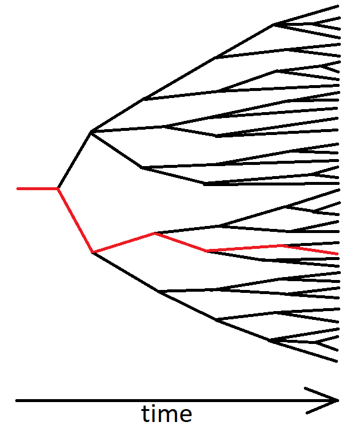

*"There is no right or wrong, so I'm going to cheat, steal and lie"* is a statement that most people would regard as 'self-serving'. They've got it *backwards*.

Moral standards define how you look at actions, events and intentions as right or wrong. My interest in morality was rekindled in my senior year due to a course called Professional Ethics - one every undergraduate had to take by their final undergraduate semester. While the course served as an excellent primer on different ethical standpoints, there was one explanation of moral relativism that was troubling. Among all the various philosophical positions on morality, moral relativism is perhaps one of the most attractive ones in the modern era. Moral relativism argues that there is no single, objective, true morality. Moral standards are only moral frames of reference, relevant to the particular society or individual. Thus, there is no absolute right or wrong. One argument against relativism is that it makes moral progress meaningless, and can make "immoral" acts acceptable. A society where slavery exists would simply be having its own set of values. If you were a relativist, the argument goes, you might not see a difference between Abraham Lincoln and Hitler. However, such an argument is rather shallow. Let's take that argument and turn it on its head: What *is* the difference between Abraham Lincoln and Hitler?

We must be able to synthesize moral principles from the ground up. If this were physics, we would ask:\
What are the foundational principles that I know are true, and how can I test whether something is true or false using these?\
As an example, why should one not steal? Simple: You get back what you give (a.k.a The principle of mirrored reciprocation). It's very easy to miss this if you're assuming a static view. If I view my interaction with a vegetable vendor as one isolated event, then, cheating him would seem like the best option if I consider my self-interest. However, we need a dynamic view: Among all the possible events that could happen in the future after this action, what is the best course, if only keeping my self-interest in mind? Since there are too many factors that we cannot control, we need to deal with probabilities. One can thus imagine our decision to lead to an entire tree of possibilities. Moral rules are a toolkit we bank on at every stage. One can visualize this as follows:

The red path is the set of outcomes in reality, while the other branches indicate all the possible outcomes that could have occurred. When judging any moral rule, we're not just interested in maximizing our rewards in the red path, we want to maximize the expected reward across *all* paths.

Coming back to the example of stealing, we need to ask:\
How exactly does the world respond to my actions?\
The answer to this would almost directly yield the answer to our previous question. Of course, there is no deterministic answer to this question (Too many factors out of our control) but we need a principle for what happens on average. Here, I'd like to bring up (read: steal) Peter Kaufman's idea of [mirrored reciprocation](https://fs.blog/great-talks/multidisciplinary-approach-thinking-peter-kaufman/) - The world reciprocates our actions, and the intensity of the response matches that of our actions. You can imagine this to be a more general version of Newton's third law of motion from mechanics, which holds true for the complex interactions of living beings as well. (If this principle seems too simple to be true, listen to Kaufman's speech for the full version). Kaufman gives a humorous example of annoying a cat - if you pick up a cat by its tail, it will try to scratch you with its claws. You start swinging the cat by its tail, it now wants to scratch your eyes out. While this is only anecdotal, studies on revenge and compassion in animals (such as in [elephants](https://phys.org/news/2006-02-elephants-revenge.html) and [wolves](https://faunafacts.com/wolves/do-wolves-seek-revenge/)) support this idea. Now, our answer to the original question on stealing follows: Because stealing inherently involves a negative impact on someone else's livelihood (or the rest of society in general), your offence is likely to be punished for. While it might happen that nobody noticed (or cared), we are looking at moral rules - these are principles that guide us for every action. Steal a few times, and a part of your tree of possibilities now ends up with you spending time in prison or having to suffer immense reputation damage. With an interest in maximizing our expected rewards, it is simply better to not steal. A similar argument can be extended to cheating (no control on who's watching).

In the beginning, I brought up a question that many would deem inappropriate:\
What *is* the difference between Abraham Lincoln and Hilter?\
To answer this, we must address the elephant in the room: murder. Well, why is murder bad? First, what exactly counts as murder? Murder is defined to be the "unlawful" killing of another human without justification or valid excuse. This definition is loaded, as we now need to deal with the rules of law (which are subjective). Remember, we're trying to derive everything from basic principles, and so "Murder is bad because you're killing a human being who is just like you" is not a good justification. Firstly, we've got to get rid of the subjective term "unlawful". Let's go simpler and look at unwarranted harm. Unwarranted, in the sense that there is no harm caused by the other person nor is there an intention to cause harm. Now, why should you not cause unwarranted harm to a fellow human? The answer - Co-operation leads to better outcomes for everybody.

To understand this, we need to listen to Adam Smith:\
“This division of labour, from which so many advantages are derived, is not originally the effect of any human wisdom, which foresees and intends that general opulence to which it gives occasion. It is the necessary, though very slow and gradual consequence of a certain propensity in human nature which has in view no such extensive utility; the propensity to truck, barter, and exchange one thing for another.” - Adam Smith, in *The Wealth of Nations*The propensity to exchange/ trade is one of the unique characteristics of human beings (Adam Smith also remarked - "No man ever saw a dog make fair and deliberate exchange of a bone with another dog"). For every human being, there is one common limitation in enriching ourselves - time. Our increasing interdependence has been at the center of rising prosperity in the past centuries. Sitting in their backyard in India, one can use oil from Saudi Arabia to drive their car, have coffee from Brazil, use electronics from China, and so forth. Every human being is thus working for the prosperity of not just themselves but also others around the world. Each life is precious even just from the standpoint of good business - a 20-year old in Brazil shouldn’t be treated worthless by someone in California, as he will probably work for the local coffee producing company which exports coffee to the US. This, of course, is just one part of the equation. What we also know now is the principle of mirrored reciprocation: inflicting harm on a person does not invite a positive response. Compassion to a stranger is also the selfish response, since you can expect a positive, enriching response from your fellow human being.

There are a number of moral principles that will probably always be in the gray area. This essay was really an effort to convince myself that there is a certain set of moral principles that we can arrive at through reason.