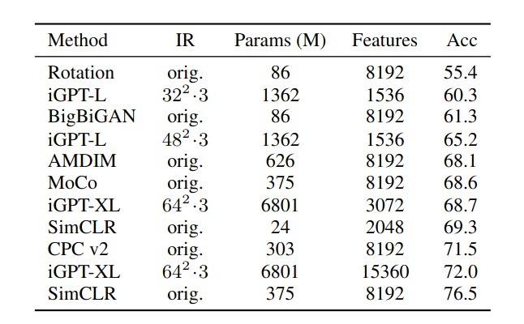

Ilya Sutskever, one of the Co-founders of OpenAI, recently gave a talk at the Large Language Models and Transformers Workshop, Simons Institute, 2023. The talk was recorded, and [is available on YouTube](https://www.youtube.com/live/AKMuA_TVz3A?si=vBMLcQcKzXPpFeom). The topic of the talk was "An Observation on Generalization", and Ilya talks about how we can reason about unsupervised learning using the lens of compression theory. I found the talk to be very insightful, however, it can be hard to follow at times and harder to keep the bigger picture in mind, atleast for someone like me (endowed with a less powerful cerebral cortex). Unfortunately, this was one of the few talks in the workshop that did not have an accompanying paper that went into more details. I felt that this was a good opportunity to write down my notes from the talk. Given how brilliantly Ilya put forth his theory, it was hard to really explain and present things differently. I have thus firstly *transcribed* the talk, and then added my own notes to provide better context or more information for clarity.

# An Observation on Generalization
The talk is about really trying to understand why unsupervised learning works at all, and reason about it mathematically. To get there, Ilya first brings up the concept of learning itself (learning from data) and why machine learning works. The expectation here is that data has regularity, and machine learning models are *expected* to learn this regularity in our data. Bringing up the topic of supervised learning, he puts up this equation:

> Low training error + more training data than "degrees of freedom" = Low test error

Now, with unsupervised learning, the dream is that given all this unlabelled data (images, text chunks, etc) we expect a machine learning model to discover this "true", hidden structure in the data. A key point with unsupervised learning is that we typically optimize a proxy objective (next work prediction or reconstruction) while we care about a different objective (learning hidden patterns in your data to do some sequence classification, perhaps). Why should this work? 

## Unsupervised learning via distribution matching
To get there, we first visit distribution matching. Consider two data sources $X$ and $Y$ which do not have any correspondence between each other. This could just look like datasets in different languages (say English and French) with no correspondence between samples. The idea with distribution matching is to find a mapping $F$ such that 

$$\text{distribution}(F(X)) \sim Y$$ 

In our above example, this is:  $\text{distribution}(F(\text{English})) \sim \text{French}$ 

There have been a number of methods proposed previously (A relevant example: [unsupervised machine translation](https://arxiv.org/abs/1711.00043)) that show that this can work even for high dimensional $X$ and $Y$. 

How can we reason about unsupervised learning now, with this background in mind?

## Compression theory
Quoting Ilya here:

> There is a one-to-one correspondence between all compressors and all predictors

At first glance, this statement is not obvious at all! I think there can be an entire article on just this statement, but to really give an intuitive (and, unfortunately, qualitative) answer:

Consider the case of compressing a PNG file. The more predictable the pixel patterns in the image, the lesser the amount of truly unique information contained across pixels, the better you can compress it. Another example that I found helpful was from [Xiaoyu He's](https://alkjash.github.io/) talk on prediction and compression [posted on LessWrong](https://www.lesswrong.com/posts/hAvGi9YAPZAnnjZNY/prediction-compression-transcript-1): 

Let's say you are trying to find an encoding for a string, where each character can only be "a", "b", "c" or "d". Consider the string "abaaabaacbabaaabcd". let's take the simple encoding scheme below:

<!DOCTYPE html>
<html>
<head>
  
</head>
</html>

| Char | Encoding |
|:----:|:--------:|
|   a  |    00    |
|   b  |    01    |
|   c  |    10    |
|   d  |    11    |

Number of bits needed for the above string: 36 bits. Suppose that all the strings in our data have the following characteristics: "a"s appear the most frequent, while "c"s and "d"s apear rarely (this is roughly the case with our anecdotal example). Thus, you can use the modified encoding scheme below:

| Char | Encoding |
|:----:|:--------:|
|   a  |    0    |
|   b  |    10    |
|   c  |    110    |
|   d  |    111    |

Number of bits needed for the string: 29 bits. By being able to better *predict* the next character for each string, we're able to better *compress* the string. 

Now, with that in mind, let's come back to the original discussion on unsupervised learning. In unsupervised learning, atleast in the realm of representation learning, we typically try to learn useful representations for our data, with the ultimate goal for using these learned representations for a downstream prediction task (say, training a linear classifier on top). A good unsupervised learning algorithm thus learns to perform good *compression* of your data. We will now use the language of compression (over prediction). 

### A simple thought experiment
Consider two datasets $X$ and $Y$. Suppose we also have a good compression algorithm $C(\text{data})$ - given a dataset d, the compressor $C$ will spit out a compressed object $C(d)$. Now, let's say we concatenate $X$ and $Y$ and compress them *jointly*. A good compressor will now use the patterns in dataset $X$ to compress $Y$ :

$$|C(\text{concat}(X, Y))| < |C(X)| + |C(Y)| + O(1)$$

(You can think of $|\cdot|$ to be some notion of size of the compressed object)

The gap between the LHS and the RHS is dictated by the shared information/structure present in the two datasets, or the algorithmic mutual information.

Okay, but how does this relate back to unsupervised learning? $Y$ can be a dataset for a supervised task you care about (sequence classsification) while $X$ is data for your unsupervised task. Ilya also talks about how this *generalizes* distribution matching i.e if there exists a function $F$ such that $\text{Distribution}(F(X)) \sim= \text{Distribution}(Y)$, then a "good" compressor should be able to find and exploit this.Why? Well you can simply consider a 2D case where all datapoints in $X$ lie approximately on the line $y=x$ and all datapoints in $Y$ lie approximately on the line $y=2x$. Being able to find the transformation function $F$ will allow you to compress your combined dataset even further.

## Formalization

Consider a machine learning algorithm $A$ that tries to compress $Y$. Suppose that the algorithm has access to dataset $X$. Now, we formalize our goal to be minimizing the *regret* of using this algorithm. The *regret* would be relative to a gold standard - in this case, in a qualitative sense, being able to get as much as we can from our unlabelled dataset $X$. 

> Low regret = "we got all the value" out of the unlabelled data, and nobody can do better!

## Kolmogorov complexity as the ultimate compressor
The Kolmogorov complexity of an object (this could be any data, really) is the length of the (or rather, a) shortest program that produces the object as its output. In essence, this is all the information you need to produce the output. If the program to create a 20MB image takes up 10 lines of code, then that program is a valid compression of your image. Taking this a step further, the following is true, for a (computable) compressor $C$:

$$K(X) \leq |C(X)| + K(C) + O(1)$$ 

While I won't dive too much into this, you can reason about this better with the previous example of string compression. Let's say we had no compressor i.e we're simply storing the string in bits. Thus, if we had a $s$, and the length of the string $s$ in bits was $|s|$, then $K(s) \leq |s| + O(1) $ (A simple relation from the definition of Kolmogorov complexity). Now, if we add in a compressor, the Kolmogorov complexity would be lesser than the size of the compressed object, along with the shortest description for the compressor.The proof for this can be summarized (rather brilliantly) in three words: The simulation argument. If you have an amazing compressor, then you should be able to simulate it using a computer program and, from the definition of Kolmogorov complexity, your new computer program, along with the size of the compressed object, can't be shorter than the optimal, shortest program for simulating X without doing any compression.

Right here, let's pause, and let Ilya lay out a brilliant analogy to neural networks. Kolmogorov complexity is uncomputable for a general $X$ (I will let [Wikipedia](https://en.wikipedia.org/wiki/Kolmogorov_complexity#Uncomputability_of_Kolmogorov_complexity) do all the heavy lifting for this one). Neural networks are computers, yes *computers* that can *simulate* different programs. SGD is the handy search algorithm that we use to efficiently search over the infinitely large space of programs/circuits.

## Conditional Kolmogorov Complexity as the solution

We look at how conditional Kolmogorov complexity can be thought of as the solution we're looking for in unsupervised learning. If $C$ is a computable compressor, then:

$$\forall X ~, 
~ K(Y|X) < |C(Y|X)| + K(C) + O(1)$$

First of all, what does the conditional Kolmogorov complexity mean? conditional Kolmogorov complexity here is the shortest program that can output $Y$, given that it can probe $X$ (or, use $X$ as an auxillary input). It quantifies how complex $Y$ is, given that you already know $X$. Consider this example: if $X$ is the collection of all the webpages on the internet, and $Y$ is just the information on www.google.com, then you can very easily describe a short program to get $Y$ given $X$, and thus $K(Y|X)$ is low. Similarly, if $X$ is just a dataset of random strings and $Y$ is the information in www.google.com, then we don't gain much from knowing about $X$, and $K(Y|X)$ is just $K(Y)$.

## Just compress everything

Some technicality on the conditional complexity mentioned above: instead of talking about "conditioning" on a dataset, where we're talking about compressors that are compressing $Y$ while being able to "access" $X$, we can also view this with respect to the concatenated dataset $\text{concat}(X,Y)$. This is because in machine learning, we can fit over large datasets, but there's no good way yet for "conditioning" on an entire dataset. A relation on the joint complexity of two datasets:

$$K(X,Y) = K(X) + K(Y|X) + O(log(K(X|Y)))$$

This comes from the [chain rule for Kolmogorov complexity](https://en.wikipedia.org/wiki/Chain_rule_for_Kolmogorov_complexity). In words, this means that the shortest program that outputs $X$ and $Y$ can be obtained from the shortest program that outputs $X$, plus the shortest program that outputs $Y$ given $X$, plus some logarithmic factor. Or, as Ilya puts it

> First, "generate" X, then "use" X to generate Y, and this can't be too different from generating the two datasets jointly

Thus, you can now simply talk about the old fashioned Kolmogorov compressor, that compressors two datasets $X$ and $Y$ jointly. Let's come back to our main discussion: in unsupervised learning, we're looking towards extracting as much value as we can out of some unlabelled data $X$, towards a goal of performing some kind of prediction on a test dataset that has the same distribution as some labelled data $Y$. We laid out how we can view unsupervised learning algorithms as being compressors, and using the equation above, you can see that the Kolmogorov complexity of the concatenated datasets is really the best you can do in terms of a good compressor, that extracts as much value as possible from $X$. 

## Joint compression is just Maximum Likelihood Estimation

Ilya now brings up an equivalence between joint compression and maximum likelihood. Suppose that we have a dataset $X$ = $x_1, x_2, ...x_N$. Then, the cost of "compressing" the dataset, using an unsupervised machine learning algorithm governed by parameters $\theta$, is the negative log likelihood - the inability of your ML algorithm/compressor to correctly assign the highest possible probability for the data samples it has seen:
$$ \text{Cost} = - \sum_i^N \log{P(x_i | \theta)}$$

Adding another dataset - or performing joint compression, is simply adding more samples to the summation above. 

A key takeway here: *Neural networks/Transformers are computers performing joint compression of all your input data samples through maximum likelihood, and we use SGD to search over the infinitely large space of possible programs that perform compression, and choose a sufficiently good compressor.*

## GPT

The GPT-N models trained by OpenAI can be understood by thinking about conditional distributions of text. During training, a causal language model like GPT is trained to perform next word prediction given a text chunk from some random document. By training over a huge, internet-scale corpus of such documents, these neural networks learn an internal model of different conditional distributions of text.

### Is this universal across data domains?

Can this work in the domain of computer vision, dealing with images or videos? Ilya brings up research from OpenAI to argue that this does work. 

### iGPT

[iGPT](https://openai.com/research/image-gpt) is an unsupervised transformer-based model trained on images. The data preprocessing is simple: They simply pre-process raw images by first resizing to a low resolution and then reshape into a 1D sequence. The model is trained to perform next-pixel prediction on these pixel sequences. Ilya now goes into more detail about the performance of iGPT across different scales, which I won't talk about here. What is interesting, or important to note is that the performance of iGPT came pretty close to the best unsupervised models trained on ImageNet. 

*Linear probe accuracies compared across different models, taken from the iGPT paper. iGPT-XL, the largest iGPT model comes close to the performance of SimCLR, the best unsupervised learning method on ImageNet at the time. Note that SimCLR used full resolution images, while iGPT used the downscaled 64x64 images. Note also the difference in parameters - iGPT has 20x more parameters*

A comment on how linear probe accuracy is measured: iGPT and SimCLR provide a representation of the image - *a good compression* - and then a linear classifier is trained on top of this representation to perform classification. The accuracy of this linear classifier is the linear probe accuracy.

## Limitations/ Unanswered questions
These are some limitations or unanswered questions that are not addressed from the above compression theory on unsupervised learning. I don't want to expand this section too much, so I will simply list out the points almost verbatim from Ilya's talk:
* Compression theory does not immediately explain why representations are nice and linearly separable.
* Linear representations are so pervasive that the reason for their formation must be very fundamental, but this is not captured.
* Auto-regressive (AR) models seem to have better representations than BERT-like models. Ilya's speculation here: With AR models, you need to predict the next word/ pixel based on all the previous word/ pixels, and you need to look at the entire context. This is not the case with BERT-like models, where you mask out a certain percentage of pixels/ words and then look a bit into the past and the future. The hardest prediction task in next word prediction is a lot harder than the hardest prediction task in masked language modeling.

## Summary

* Ilya delves into the mathematical and conceptual foundations of unsupervised learning, formalizing how machine learning algorithms learn from unlabelled data by capturing its inherent regularities. 
* Compression theory can be used to explain unsupervised learning. There is a one-to-one correspondence between all compressors and predictors, and a good unsupervised learning algorithm needs to perform good compression of your data, to get good *prediction* on a downstream supervised learning task.
* Kolmogorov complexity can be viewed as the gold standard for compression. In unsupervised learning, we're looking towards extracting as much value as we can out of some unlabelled data $X$, towards a goal of performing some kind of prediction on a test dataset that has the same distribution as some labelled data $Y$. Unsupervised learning algorithms are trained to be good joint compressors via maximum likelihood, and the Kolmogorov complexity of the concatenated datasets is the best you can do in terms of a good compressor, that extracts as much value as possible from $X$. 
* Neural networks are computers that can simulate different programs, and SGD is the handy search algorithm that we use to efficiently search over the infinitely large space of programs/circuits to get as close as we can to the optimal program (Kolmogorov complexity).
*  The Generalized Pre-trained Transformers (GPT) models by OpenAI and their variants in other domains like computer vision (iGPT) are some real-world examples of unsupervised learning via the proxy task of next-token/pixel prediction. Next-token/pixel prediction has been shown to be a good proxy to learn the true, hidden structure in your data i.e to perform good compression. 
* Some limitations of this theory are that it does not explain the linear representations we obtain from good unsupervised learning algorithms, and we also don't understand why auto-regressive modelling is superior to masked language modelling in learning good representations.

