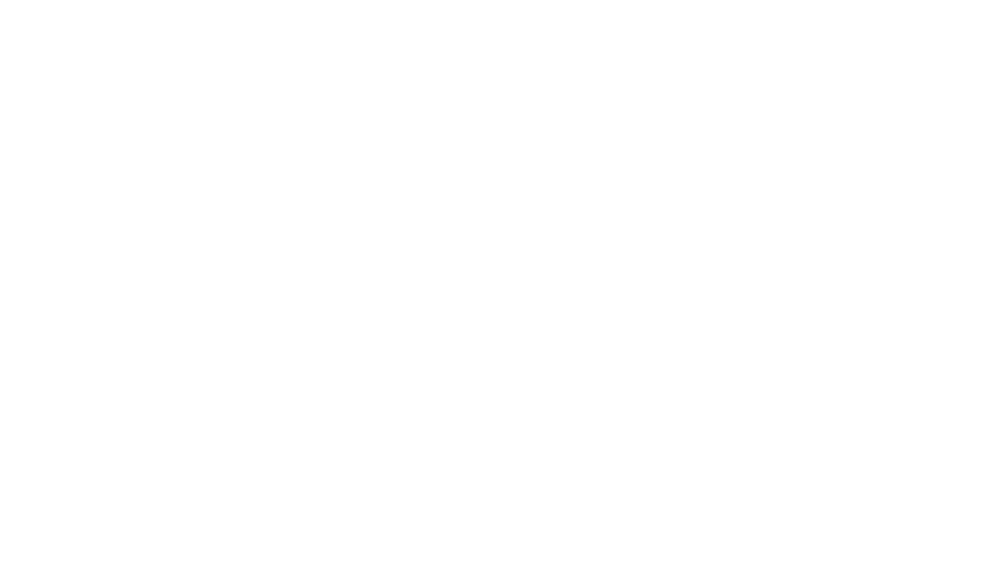

After the release of OpenAI's O1, which came with this awesome graph below, I think it's a good time to understand test time scaling and current research in this area. 

Sasha Rush's talk: https://www.youtube.com/watch?v=6PEJ96k1kiw was a great overview of what O1 means and the different suspects of how O1-like behaviour can be achieved. These are some of my notes from the talk, annotated with some context given the large amount of RL literature behind it. 

Introduction to Reinforcement Learning:
- Lilian Weng's blog: 
- David Silver's Intro to RL course: https://www.youtube.com/watch?v=2pWv7GOvuf0 
- Noam Brown, from [[OpenAI]], developed AI systems that could beat top human players in poker, recognized as one of the top scientific breakthroughs in 2019, and was awarded the [[Marvin Minsky]] medal. [(00:00:10)](https://www.youtube.com/watch?v=eaAonE58sLU&t=10s)
- Brown's AI system, trained on roughly one trillion hands of poker, lost to human experts in the 2015 Brains vs. AI poker competition, but he noticed that the AI acted almost instantly, while humans took time to think through difficult situations. [(00:03:06)](https://www.youtube.com/watch?v=eaAonE58sLU&t=186s)
- Brown found that adding search and planning capabilities to the AI system resulted in a 7x reduction in distance from Nash equilibrium, equivalent to scaling the models by 100,000x, a much greater improvement than the 100x scaling he had achieved in three years.

Qwen 2.5 math: https://arxiv.org/pdf/2409.12122 