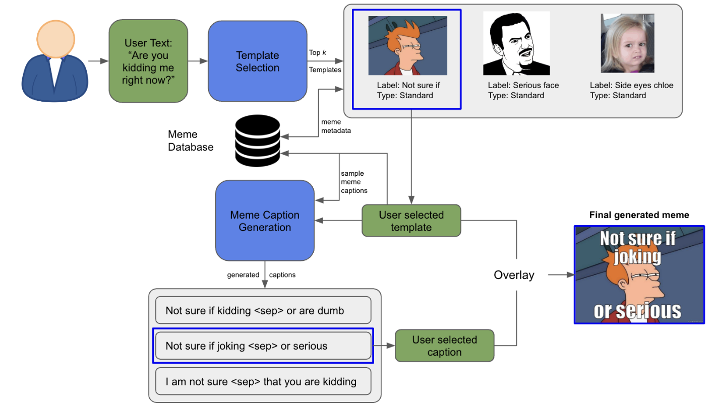

This project was based on a serious mission to empower everyone to be creative by delegating some of the work to AI. Introducing Jester, a text-to-meme generation engine (try it out [here](https://the-jester.streamlit.app/)). The idea is simple: if you're texting with a friend, it should be very easy to quickly make a relevant meme based on some input text. This involves retrieving a meme template for given user text and then translating that text into a witty, relevant meme caption. The system overview is given below:

Design choices summarized:
* Meme templates are based on what is popular and already adopted by the masses. The relevant task is retrieval/selection over say,generation.
* User text -> Meme caption is a translation task that needs data. Since there is no such dataset available yet, we need to come up with the data ourselves. The task should be conditioned on the templates (For the "Not sure if" template above, for example, the meme caption always starts with "Not sure if"). The system should thus be a good few shot learner like GPT-3.
* The Meme template selection task should be flexible and should incorporate new templates easily. Avoiding a softmax layer is a good thing. 

We first trained a RoBERTa model using Contrastive Loss (following [Sentence Transformers](https://www.sbert.net/)) and used a nearest-neighbour like technique to select a meme template for a given user prompt. We labelled 5 (user prompt, meme caption) pairs for 100 templates and crafted custom prompts for GPT-3. The overall system is better both quantitatively and qualitatively over baselines. More details in the report [here](https://github.com/SumanthRH/text-to-meme/blob/main/Final_Report.pdf).  
